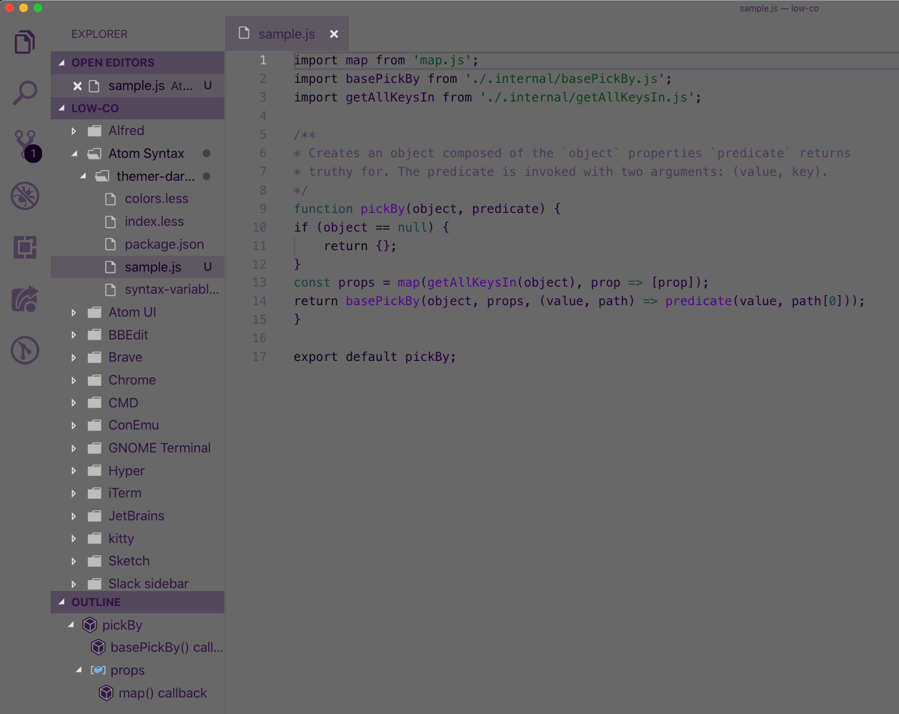

# low-co: A not-so-crazy low contrast theme

I created this theme for days when I'm having light sensitive headaches and migraines and want to still try to get some work done. It's a dark, low contrast theme for just those sorts of days.

In the editor I use, it looks a little like this:

Feel free to fork and use if you please. <3
